# Welcome to 멍냥이 빌리지


> 멍냥이 빌리지 (Village) 웹사이트 

## 🏠 [Homepage](https://j4b106.p.ssafy.io)

<br>

## 👨‍👩‍👦팀원소개


**Jin Ok Seong**
- Github: [@wlsdhr0831](https://github.com/wlsdhr0831)

**Ji Yeong Park**
- Github: [@](https://github.com/)

**Seong Ho Park**
- Github: [@solser12](https://github.com/solser12)
<<<<<<< HEAD

**Min Seok Cha**
- Github: [@meloncha](https://github.com/meloncha)

**Da Yun Kim**
- Github: [@daaaaaayoon](https://github.com/daaaaaayoon)

<br>

=======

**Min Seok Cha**
- Github: [@meloncha](https://github.com/meloncha)

**Da Yun Kim**
- Github: [@daaaaaayoon](https://github.com/daaaaaayoon)

<br>

>>>>>>> master
## 📆 프로젝트 개요

- **진행 기간** : 2021.3.2 ~ 2021.4.9
- **목표**
    - 유기동물 보호소에 기부를 하고 싶은 사람,
    - 기부금의 사용내역을 투명하게 확인하고 싶은 사람,
    - 기부를 받고 싶은 유기동물 보호소,
    - 유기동물들의 랜선 집사가 되고 싶은 사람,
    - 유기동물을 입양 하고 싶은 사람,
    - ⭐ 이 모든 사람들을 위한 웹 사이트 만들기
- **웹사이트 이름**: 멍냥이 빌리지
  - 블록체인을 이용한 유기동물 보호소 기부 플랫폼

## 📘 Tech Log
<<<<<<< HEAD
+ [Convention](./documents/Convention.md)
+ [Wireframe](./documents/WireFrame.pdf)
+ [화면 정의서](./documents/StoryBoard.pdf)
+ [Swagger-UI](./documents/swagger-ui)
=======
+ [Convention](./documents/docs/Convention.md)
+ [Wireframe](./documents/docs/WireFrame.pdf)
+ [화면 정의서](./documents/docs/StoryBoard.pdf)
+ [Swagger-UI](./documents/docs/swagger-ui)
>>>>>>> master

## 🔗Tech Stack

<details>
  <summary>BlockChain</summary>
  <ul>
      <li>web3.js</li>
      <li>Ethereum TestNet</li>
      <li>Custom Token (MABL)</li>
      <li>metamask</li>
  </ul>
</details>
<details>
  <summary>Frontend</summary>
  <ul>
      <li>react</li>
      <li>redux, redux-saga</li>
      <li>typescript</li>
      <li>postcss</li>
  </ul>
</details>
<details>
  <summary>Backend</summary>
  <ul>
      <li>Spring Boot</li>
      <li>Spring Data JPA</li>
      <li>Spring Security</li>
      <li>Swagger</li>
      <li>Docker & Jenkins</li>
      <li>Redis</li>
      <li>WebRTC(Kurento)</li>
  </ul>
</details>
<details>
  <summary>협업툴</summary>
  <ul>
      <li>GitLab</li>
      <li>Jira</li>
      <li>Swagger</li>
      <li>Webex</li>
      <li>Mattermost</li>
      <li>figma</li>
      <li>Notion</li>
  </ul>
</details>

## Data Flow 
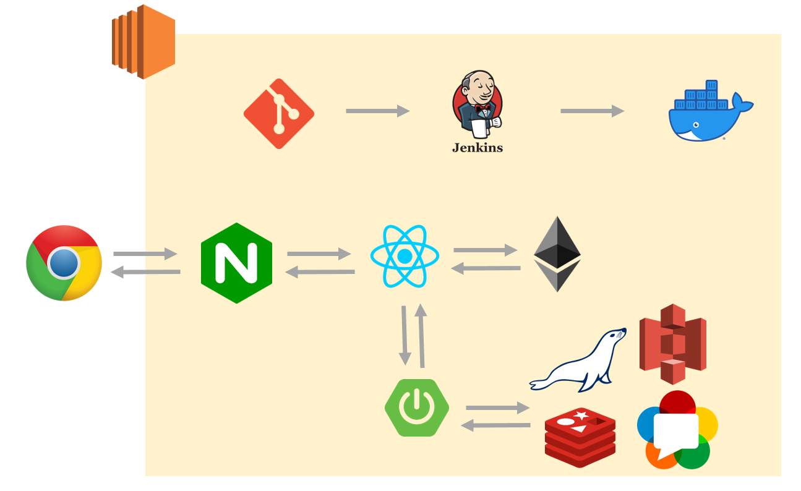

## 주요 기능
### 개인 유저 Profile
- 회원 정보 RUD
- 내 지갑 주소, 금액, 내역 확인

### 보호소 유저 Profile
- 회원 정보 CRUD
- 내 지갑 주소, 금액, 내역 확인
- 월별 입양 보낸 동물 수 확인

### 보호소 유저 메인 페이지
- 소개글
- 사이트 링크
- 메인 배너 이미지
- 보호소 전화번호
- 보호소 이메일
- 보호 하고 있는 동물 CRUD
- 1:1 채팅

### 보호소 스트리밍
- 실시간 영상 송출

### 보호소 검색
- 검색 필터 :  보호소 이름
- 이름, 썸네일, 소개글 제공
- 클릭 시 보호소 메인 페이지로 이동

### 유기 동물 검색
- 검색 필터 : 모두/개/고양이/기타, 이름으로 검색
- 이름, 썸네일, 성별, 나이, 생일 정보 제공
- 클릭 시 동물 상세 모달창

### 유기 동물
- 이름, 이미지, 성별, 나이, 생일, 품종, 몸무게, 성격, 특징, 중성화 수술 정보 제공
- 보호소 유저가 소개글 CRUD

## ⚙️Install and Usage
<<<<<<< HEAD

### Frontend

- frontend 폴더로 들어와 필요한 패키지를 설치합니다.

    ```java
    npm i
    ```

- frontend 폴더 (react 프로젝트)를 실행합니다.

    ```bash
    npm start
    ```

### Backend
- Java (Open JDK 11)를 설치합니다.
- Gradle을 설치합니다.
- Docker를 설치합니다.
> Maria DB 컨테이너 실행
- `docker run --name-db -p 3306:3306 -e MYSQL_ROOT_PASSWORD=패스워드 -d mariddb`
- `docker exec -it maria-db mysql -u root -p`

## 👀페이지 소개
### main
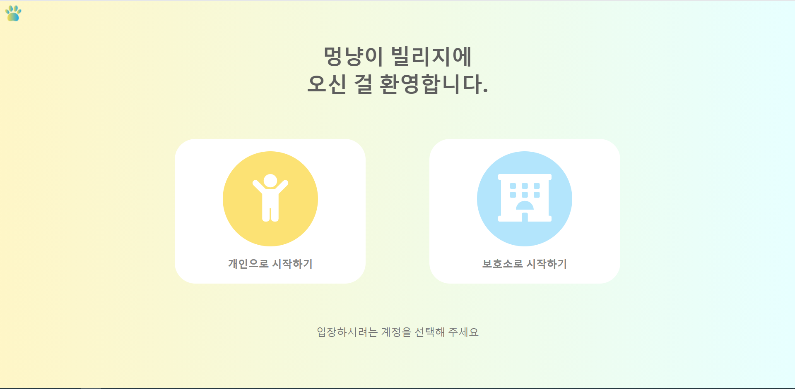
### 로그인
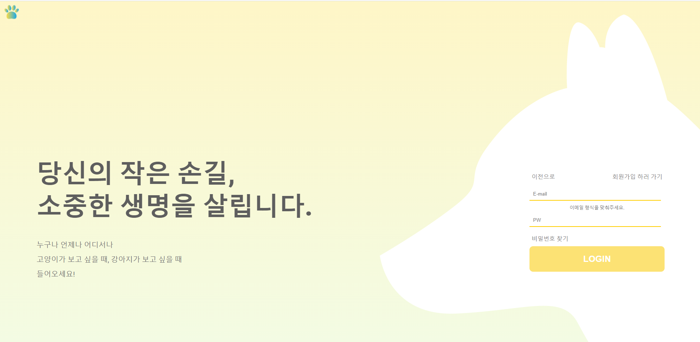
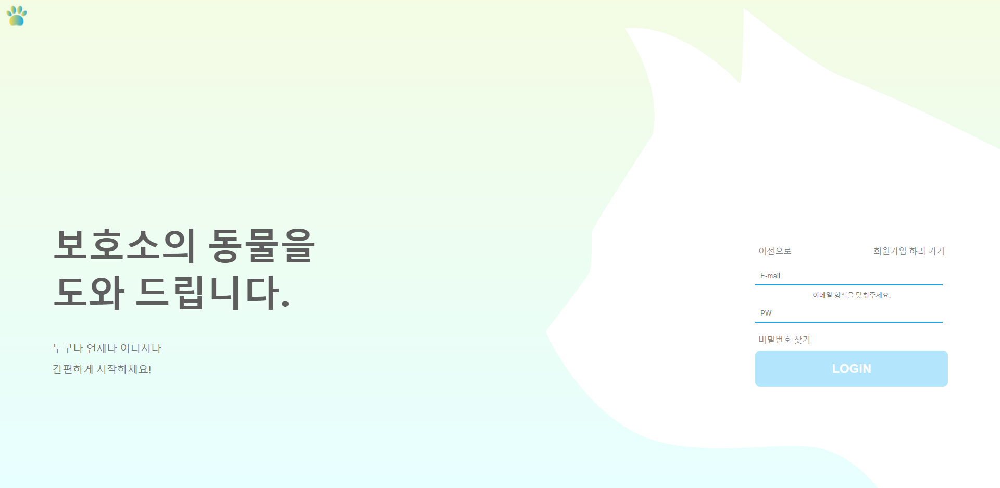
### 회원가입
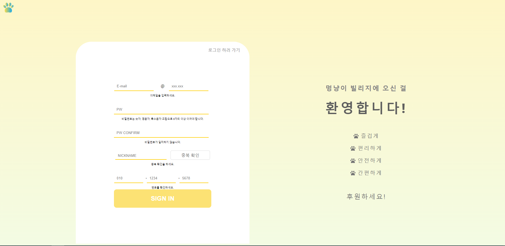
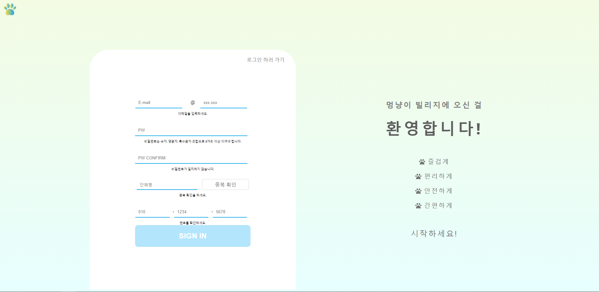
### 비밀번호 찾기
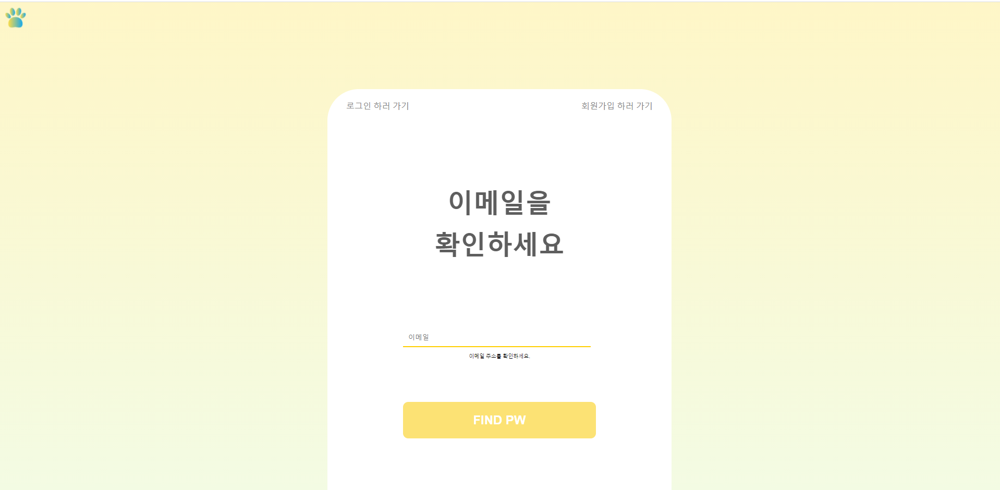
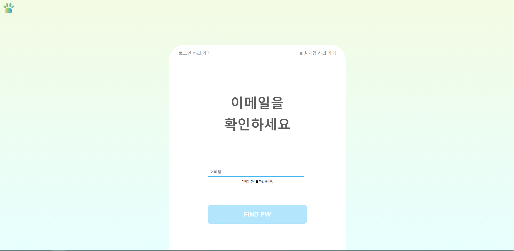
### 개인 유저 메인
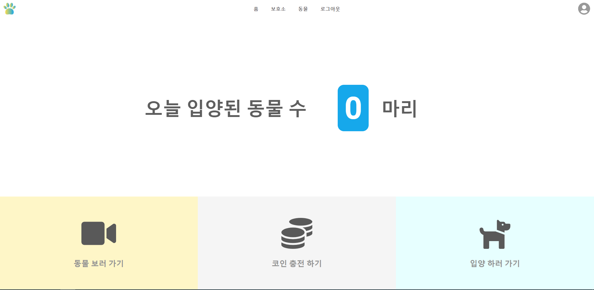
### 마이페이지

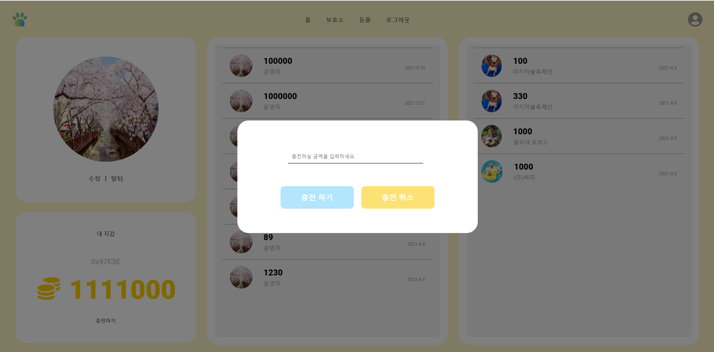
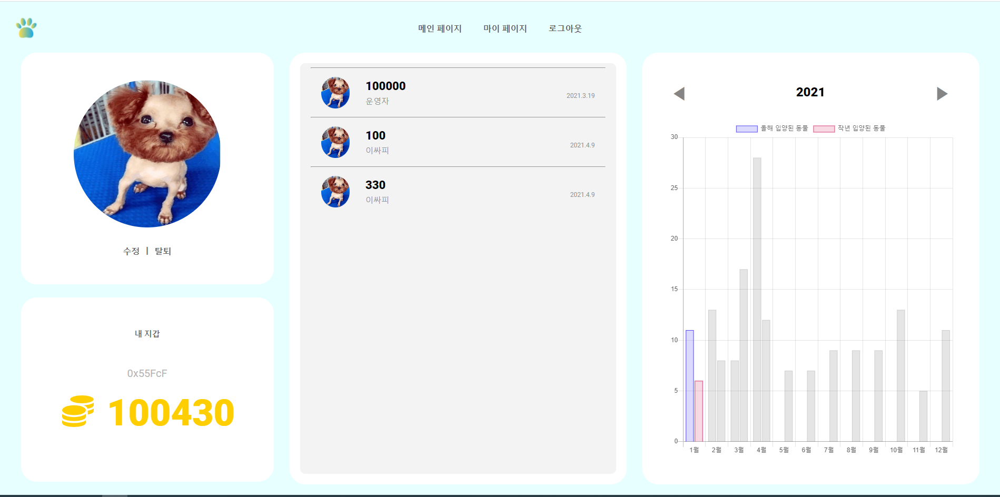
### 보호소 메인 페이지


### 보호소 리스트
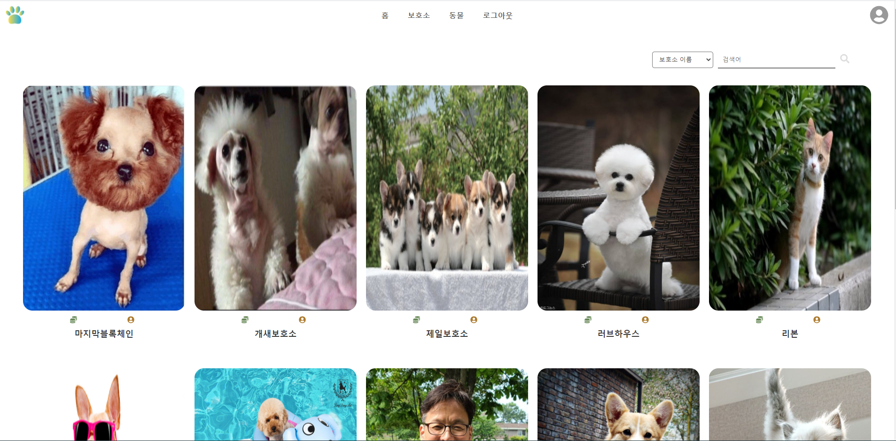
### 동물 리스트
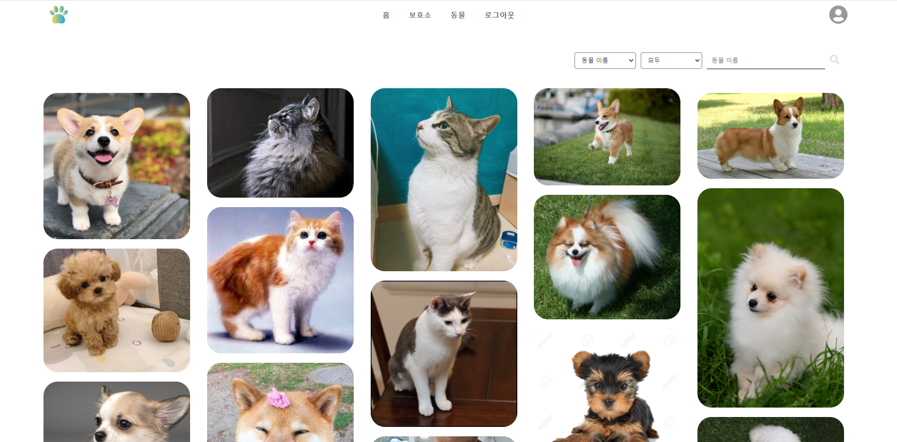
### 스트리밍
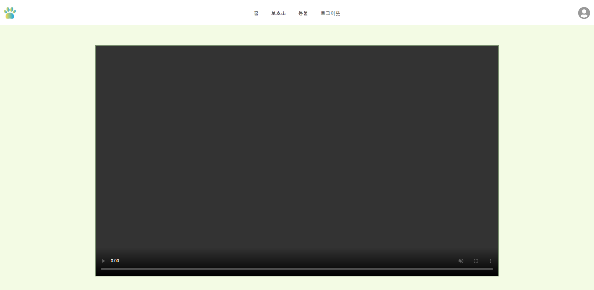

=======

### Frontend

- frontend 폴더로 들어와 필요한 패키지를 설치합니다.

    ```java
    npm i
    ```

- frontend 폴더 (react 프로젝트)를 실행합니다.

    ```bash
    npm start
    ```

### Backend
- Java (Open JDK 11)를 설치합니다.
- Gradle을 설치합니다.
- Docker를 설치합니다.
> Maria DB 컨테이너 실행
- `docker run --name-db -p 3306:3306 -e MYSQL_ROOT_PASSWORD=패스워드 -d mariddb`
- `docker exec -it maria-db mysql -u root -p`

## 👀페이지 소개

>>>>>>> master
## 🎞️최종 산출물
- **최종 발표 UCC**

- **최종 발표**

